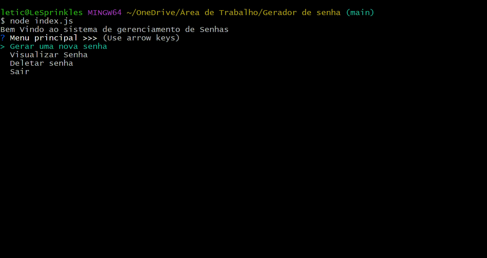

## Sistema que gera senhas aleatorias via terminal ##

## Criando o Menu ##

- Gerar uma nova senha
    # Sub menu #
    - Quantidade de Caracteres da Senha
    - Nome da senha
    - Nova senha
    - Pin de Acesso a senha (usuário que cria)
- Visualizar senha
    - Nome da senha
        - Pin de Acesso a senha
        - Senha
- Deletar senha
    - pin de Acesso a senha
    - Nome da senha

## Criando a senha ##
- Gerar uma nova senha
- vai pedir ao usuário a quantidade de caracteres
- Nome para a senha
- Criar o Pin de Acesso a senha (usuário que cria)
- Exibir senha

## Visualizar senha ##
- Vai pedir o Nome da senha
- Pin de Acesso a senha
- Mostar senha

## Deletar senhas ##
- Vai pedir o nome da senha
- Vai pedir o Pin de acesso
- Senha deletada

